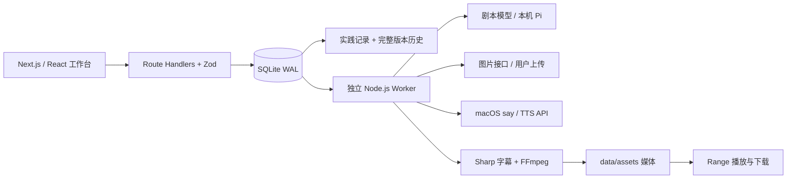

<div align="center">

# 漫序 · FrameFlow

**让创作经验，成为可复用的系统。**

个人 AIGC 产品实践工作台 · 研究 / 评测 / 创作 / 质量复测 / 方法沉淀

[v2 体验指南](docs/漫序v2体验指南.md) · [快速开始](#快速开始) · [产品设计](docs/PRD.md) · [当前进度](docs/当前进度.md) · [验证记录](docs/验证记录.md)

</div>


## 这是什么

漫序把产品研究、人工模型评测、漫剧创作、问题定位和复测放在同一条实践链路上。本轮 v2 在原有故事、角色、分镜、素材与 MP4 制作能力上增加统一总览、实践记录及方法入口，面向个人持续沉淀，而非仅展示一次出片。

第一次打开可按 [v2 体验指南](docs/漫序v2体验指南.md) 走完「研究 → 人工评测 → 镜头卡 → 质量复测 → 分享」；指南说明每个入口能实际做什么、哪些仍需要人审，以及来源和费用的边界。

定位来源于用户提供的 2026.03–05 快看漫画 AI 产品实习经历；软件是实习之后的个人实现。**2026-09-22 课程 MVP 的历史保持不变，本轮不声称漫序是快看内部系统或公司业绩。** [PRD](docs/PRD.md) 顶部为 v2 增补，后半保留课程 v1.1 全文。

v2 提供完整本机版与公网交互体验版。技术包版本继续沿用原稳定版本；实际验证范围见 [验证记录](docs/验证记录.md)。

- [直接体验漫序](https://s6fc4hec1r2qhhkrj949b.apigateway-cn-beijing.volceapi.com/)
- [六步操作动画：可播放、暂停、逐步浏览](https://s6fc4hec1r2qhhkrj949b.apigateway-cn-beijing.volceapi.com/tour.html)
- [直接查看 / 下载 GIF 演示](docs/demo-v2/walkthrough.gif)
- [部署方式与能力边界](docs/PUBLIC_DEPLOYMENT.md)

公网版支持研究、评测、分镜编辑、问题定位、版本与档案导出；输入只保存在访问者当前浏览器。清除浏览器数据会丢失，请导出备份。示例成片为本机真实合成后预置。实时模型调用、图片上传和配音/视频合成使用完整本机版，公网版没有共享数据库或模型凭证。

**你掌握每一镜的决定权。** 生成剧本不会自动触发生图；生成图片只处理缺失画面；合成前检查素材。任务和中间产物保存在本地，刷新页面可恢复进度。

## 能做什么

### v2 实践与审阅工作台

- **统一入口**：总览、研究与需求、模型评测、质量与复测、知识分享、六项 Skill 方法资产；记录可关联具体创作项目。
- **可追溯台账**：SQLite 保存研究依据、冻结样例、模型/Prompt 版本、原始输出、问题和复验。记录支持 UUID 幂等创建、revision 冲突保护、版本历史查看与导出。
- **明确复核版本**：项目内容变化后原审阅显示需复核，普通编辑记录不会自动消除提示；实际重新检查并明确确认当前项目版本后才重新锚定。删除作品保留实践记录和历史、解除关联。
- **人工镜头卡**：记录角色、道具、起止状态和准确台词。台词字段用于审阅，不自动生成独立角色配音；状态卡不是自动视觉识别或锁脸。
- **媒体问题与复测**：记录集/片段、源镜头、问题时间、阶段、音轨建议、返工范围和局部/相邻/全片检查；表单记录不自动剪辑或静音源声。
- **真实与未知分开**：人工指标留空表示未知，不能等同于零；费用有值必须附依据，积分和尝试次数说明来源与口径，不按积分或 Token 自动换现金。教学示例不计入实测统计。
- **从成片回到镜头**：新本地合成保存编码镜头的时间区间；时长保留两位小数，拼接与帧舍入可能有偏差，切点仍需播放器复核。没有编码区间的旧片只显示计划区间，配音延长后不能将计划当实际时间。

### 继续复用的创作能力

- **故事工作台**：创建作品、搜索筛选、原创示例、项目 JSON 导出。
- **AI 编剧**：OpenAI 兼容 Chat Completions 接口，或本机已登录 Pi；对角色与分镜 JSON 进行运行时校验。
- **角色档案**：固定外貌、服装、性格，在每个图片生成请求中带入同一套描述。
- **分镜编辑**：修改画面、台词、时长、镜头运动，调整顺序、添加和删除镜头。
- **画面制作**：PNG/JPG/WebP 上传与验证；可选兼容 Images API。UI 区分示例、上传和 AI 生成素材。
- **动态漫画合成**：FFmpeg 镜头推拉、中文旁白、画面字幕、独立 SRT、横屏/竖屏 MP4。
- **可靠任务**：SQLite 持久化、服务端幂等、防并发覆盖、取消、部分成功、失败恢复和 Range 视频播放。


### 六项方法与来源

这些公开 Skill 提供方法和独立工具，本工作台不会自动安装或执行它们。

| 方法 | 公开仓库 | 工作台接合点 |
|---|---|---|
| 模型评测工作流 | [model-eval-workflow](https://github.com/Yiheng-guo/model-eval-workflow) | 固定任务与规则，保留原始输出、失败和未知指标 |
| AI 产品拆解 | [ai-product-teardown](https://github.com/Yiheng-guo/ai-product-teardown) | 证据、观察、推断、需求与验证计划 |
| 剧本策划 | [aigc-script-development](https://github.com/Yiheng-guo/aigc-script-development) | 人物、时长和硬约束的人审 |
| 分镜连续性 | [aigc-storyboard-planning](https://github.com/Yiheng-guo/aigc-storyboard-planning) | 角色道具起止状态与相邻镜头复核 |
| 媒体问题定位与修复 | [aigc-media-badcase-review](https://github.com/Yiheng-guo/aigc-media-badcase-review) | 定位、最小修复建议、三层复验 |
| 视频交付检查 | [aigc-video-delivery](https://github.com/Yiheng-guo/aigc-video-delivery) | 技术检查、人工审片与费用依据分开 |

本轮调研 promptfoo、LangGraph.js、Toonflow、MoneyPrinterTurbo 等机制，采用评测实体、持久化确认、阶段产物和连续性审阅，自行实现页面与数据契约，未复制上游源码或引入其运行时。

完整依据：[开源调研与采用决策](docs/OPEN_SOURCE_RESEARCH_2026-10-03.md) · [实习与六项资产映射](docs/INTERNSHIP_ASSET_MAP.md) · [外部早餐短剧实践映射](docs/BREAKFAST_PRACTICE_MAP.md)。

《下次做给我吃》在另一个平台完成，平台未由用户指名。这里只借鉴个人实践方法与公开复盘；六集、403 秒、124 笔视频生成及 11,460 积分均**不是漫序产出或运行统计**。

## 快速开始

### 环境

- **Node.js 24+**、npm；macOS / Windows / Linux。
- 安装依赖时会从 npm 获取对应平台的 FFmpeg。也可以设置 `FFMPEG_PATH` 使用自己的版本。
- macOS 默认使用系统中文语音 `Tingting`；Windows/Linux 默认生成无配音视频，可配置 TTS 接口。
- Linux 渲染中文建议先安装 `fonts-noto-cjk`。没有中文字体时请勿将缺字字幕作为交付。

```bash
git clone https://github.com/Yiheng-guo/manxu-studio.git
cd manxu-studio
npm ci
cp .env.example .env.local
npm run dev
```

上述克隆命令获取 GitHub 公开源码；已有本地仓库可直接进入该目录安装与启动，无需重复克隆。

Windows PowerShell 可用 `Copy-Item .env.example .env.local`。

打开 **[漫序本机工作台](http://127.0.0.1:3210)**。从统一总览进入「创作工作室」，打开原创示例，查看分镜并进入「配音成片」合成。也可以在研究、评测与质量页面建立人工记录。**示例、手动编辑、记录、图片上传和本地导出不需要模型 Key。** AI 剧本或图片生成需要实际可调用的账号与服务配置。

启动脚本同时运行网页与独立任务 worker。不要只运行 `next dev`，否则后台任务不会启动。开发中修改 worker 代码或 `.env.local` 后，需要重启 `npm run dev`。

### 配置剧本模型

在 `.env.local` 中配置兼容 Chat Completions 的服务：

```dotenv
AI_PROVIDER=openai
AI_BASE_URL=https://你的接口地址/v1
AI_MODEL=你的模型名称
AI_API_KEY=你的密钥
```

如果已安装并登录 [Pi Coding Agent](https://github.com/earendil-works/pi)，也可以：

```dotenv
AI_PROVIDER=pi
PI_PROVIDER=你的提供商名称
PI_MODEL=该账号实际可用的模型名称
```

先在终端中验证 `pi --provider <提供商> --model <模型> -p "你好"`。模型出现在列表里不代表账号可以调用。Pi 模式禁用工具、扩展、技能、项目上下文和会话保存，仅用于生成剧本文本；使用相应账号额度。

若 CLI 网络需要代理，请使用你本机已配置的代理地址，并确保本地地址不经过代理。例如按自己环境设置 `HTTPS_PROXY`、`HTTP_PROXY`、`NO_PROXY=localhost,127.0.0.1`、`NODE_USE_ENV_PROXY=1`。项目不内置特定代理地址。

### 配置图片与配音（可选）

```dotenv
IMAGE_BASE_URL=https://你的图片接口/v1
IMAGE_MODEL=图片模型名称
IMAGE_API_KEY=你的图片密钥

TTS_PROVIDER=openai
TTS_BASE_URL=https://你的语音接口/v1
TTS_MODEL=你的语音模型
TTS_VOICE=你的音色
TTS_API_KEY=你的语音密钥
```

图片适配的是同步 `POST /images/generations`，响应需要包含 `data[0].b64_json` 或可下载的 HTTPS `url`。默认请求尺寸为横向 `1536x1024` 或竖向 `1024x1536`，合成时裁切为目标画幅。**并非所有图片平台都支持这套参数和协议**；异步图片/视频服务需要另写适配器。

语音适配 `POST /audio/speech`，请求 MP3 二进制输出。`TTS_PROVIDER=none` 可显式禁用配音。

**不把密钥写进前端或提交 Git。** `.env.local`、数据库和用户媒体目录默认被忽略。

## 使用流程

实践链路：在研究页留下来源和需求 → 在评测页固定样例、通过条件和原始结果 → 进入作品制作与逐镜审阅 → 在质量页定位问题并复测 → 导出记录或知识分享草稿。自动生成与手工记录分别显示，不将填表视为模型调用。

1. 新建作品，填写主角、冲突、结局和视觉风格。
2. 点击「AI 生成剧本与分镜」，等待真实模型结果；也可以手动创建分镜。
3. 检查角色档案和镜头叙事，编辑后点击「保存」。
4. 逐镜上传画面，或连接图片接口后「生成缺失画面」。
5. 使用分镜预演检查顺序与台词，进入「配音成片」。
6. 开始合成，完成后播放、下载 MP4 / SRT；导出 JSON 留存剧本。

配音长于镜头计划时，会自动延长镜头，避免台词被截断；新合成从编码片段读取区间，便于回到镜头检查。单个作品最多 12 镜，每镜 2–30 秒，旁白最多 160 字；“集/片段”是质量记录字段，不代表已增加全套多集排产系统。

## 架构



采用 Node.js 全栈以减少课程项目的环境负担。技术适配和 API 说明见 [技术适配声明](docs/技术适配声明.md) 与 [架构与接口](docs/架构与接口.md)。

| 目录 | 用途 |
|---|---|
| `src/app` | 页面、API 与全局样式 |
| `src/components` | 工作台、分镜编辑器、公共交互 |
| `src/lib/schema.ts` | 前后端共享数据契约 |
| `src/lib/server` | 数据库、模型适配、媒体合成 |
| `scripts/worker.ts` | 持久化任务消费与取消处理 |
| `public/demo` | 原创 AI 示例画面和已验证成片 |
| `tests` | 核心规则、并发保护与浏览器闭环测试 |
| `data` | 本地私有数据库和媒体，不进仓库 |

## 检查与生产模式

```bash
npm run lint
npm run typecheck
npm test
npm run build
npm start
```

浏览器自动化（先启动应用）：

```bash
npx playwright install chromium
npm run test:e2e
```

已安装 Chrome 时可跳过浏览器下载：`PLAYWRIGHT_CHANNEL=chrome npm run test:e2e`（PowerShell 用 `$env:PLAYWRIGHT_CHANNEL="chrome"`）。CI 使用 Chromium 和 Node 24。

## 数据与恢复

- 项目与任务：`data/studio.sqlite`，开启 WAL。
- 媒体：`data/assets/<项目ID>/`。
- 备份：停止服务后复制整个 `data` 目录。JSON 只包含项目内容和媒体引用，不包含二进制素材。
- 浏览器刷新或断线：按项目 ID 恢复，任务仍在 worker 中运行。
- worker 重启：运行中的任务标记为中断并保留已有素材；队列继续消费。模型任务不会在不知情的情况下自动重复调用。
- 删除作品会移除作品与任务记录，关联实践记录解除关联并保留历史；磁盘素材暂留供人工备份/清理，本版本没有自动垃圾回收。单独删除实践记录会删除该记录及其历史，先导出所需备份。

## 验证与当前边界

### 2026-09-22 课程 MVP 的已记录实测

- 已完成真实 Pi 模型剧本生成，原始结构化结果见 [AI 生成样例](docs/ai-script-example.json)。
- 已合成并检查 30 秒、1280×720、带中文配音与字幕的 [示例 MP4](public/demo/film.mp4)。
- 示例 PNG 是开发时生成的原创 AI 素材，**不是用户点击后实时生成**。
- 图片兼容接口和外部 TTS 适配已实现，但本次没有这两类接口凭证，**没有宣称真实供应商联调通过**。上传图片、本机中文配音和视频合成已实测。
- 角色文字档案能约束提示词，但不保证不同生图模型达到严格身份一致；本版没有 LoRA、参考图锁脸或口型动画。
- **运行形态仍为本地单用户工具。** 默认仅绑定 `127.0.0.1`，API 校验同源写入。没有多用户账户和权限隔离，不应直接暴露到公网。GitHub 上传源码不等于网站部署上线。
- macOS 实测；Windows/Linux 的安装路径与无配音降级已设计，尚未在真实设备测试。

### v2 本轮需验收的新增实现

新增工作台、台账历史、冲突/幂等、需复核状态、人工镜头卡、媒体复测和编码区间，需通过本轮检查后在 [验证记录](docs/验证记录.md) 中记录实际结果。本说明不复用课程测试数量作为 v2 已通过的证据，也不宣称研究质量、返工费用或跨集表现得到量化提升。

本轮没有自动批量模型评测、视觉审阅、GPU 锁脸、口型生成、外部视频上传剪辑或自动停用声轨。评测与质量指标来自人工记录；历史外部案例不能变成本平台自动采集数据。

## 参考与原创范围

参考 [MoneyPrinterTurbo](https://github.com/harry0703/MoneyPrinterTurbo) 的“脚本 → 素材 → 配音 → 字幕 → 视频”流水线思路。本项目独立实现漫剧角色档案、分镜编辑器、任务系统与前端，没有将参考项目换名字直接提交。

来源、上游版本、MIT 许可与素材生成记录见 [THIRD_PARTY_NOTICES.md](THIRD_PARTY_NOTICES.md) 和 [素材来源](docs/素材来源.md)。课程展示时应主动说明参考来源与 AI 辅助开发范围。

项目代码采用 [MIT License](LICENSE)。依赖项遵循各自许可证。
