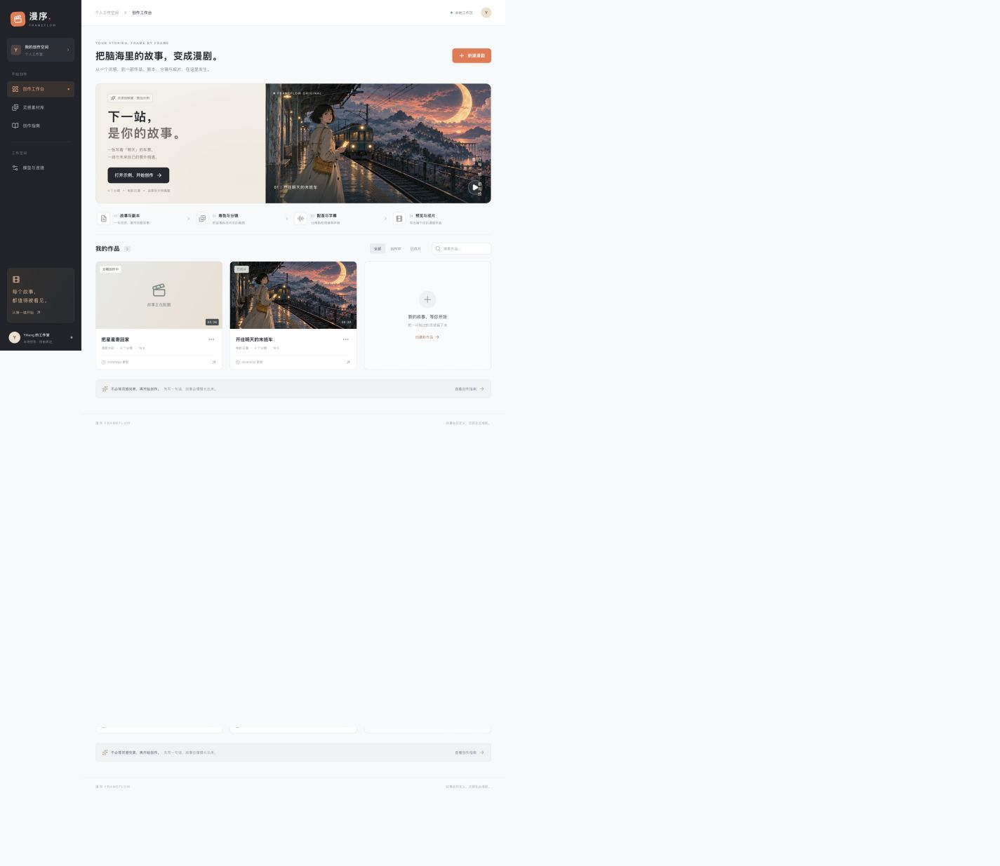
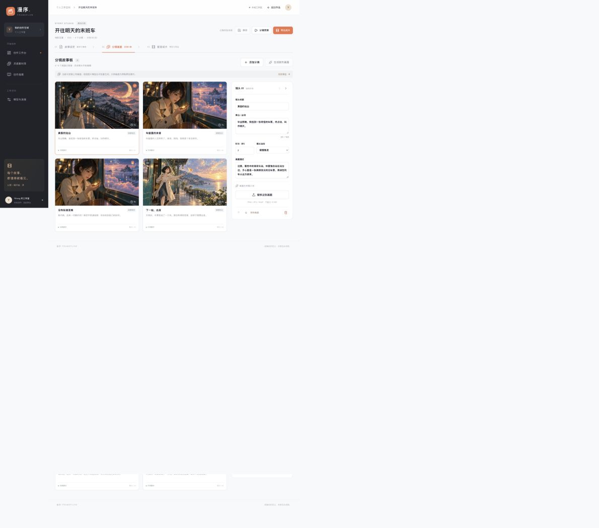
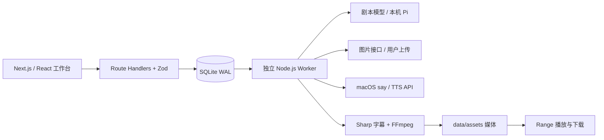

<div align="center">

# 漫序 · FrameFlow

**让脑海里的故事，一帧一帧成为作品。**

AI 漫剧创作工作台 · 剧本 / 角色 / 分镜 / 配音 / 字幕 / MP4

[快速开始](#快速开始) · [项目设计](docs/PRD.md) · [课堂演示](docs/课堂演示.md) · [验证记录](docs/验证记录.md) · [原创示例视频](public/demo/film.mp4)

</div>



## 这是什么

一个可以在本机运行的 AI 漫剧课程项目。输入故事创意，使用模型生成结构化剧本和分镜；审阅角色设定、修改旁白与镜头，上传或生成画面，再合成可播放、可下载的动态漫画。

完整 [产品需求文档（PRD v1.1）](docs/PRD.md) 包含用户场景、13 项功能需求、数据与异常规则、23 项验收用例及版本计划，并区分已实现、已实测、待联调和后续规划。

**你掌握每一镜的决定权。** 生成剧本不会自动触发生图；生成图片只处理缺失画面；合成前检查素材。任务和中间产物保存在本地，刷新页面可恢复进度。

## 能做什么

- **故事工作台**：创建作品、搜索筛选、原创示例、项目 JSON 导出。
- **AI 编剧**：OpenAI 兼容 Chat Completions 接口，或本机已登录 Pi；对角色与分镜 JSON 进行运行时校验。
- **角色档案**：固定外貌、服装、性格，在每个图片生成请求中带入同一套描述。
- **分镜编辑**：修改画面、台词、时长、镜头运动，调整顺序、添加和删除镜头。
- **画面制作**：PNG/JPG/WebP 上传与验证；可选兼容 Images API。UI 区分示例、上传和 AI 生成素材。
- **动态漫画合成**：FFmpeg 镜头推拉、中文旁白、画面字幕、独立 SRT、横屏/竖屏 MP4。
- **可靠任务**：SQLite 持久化、服务端幂等、防并发覆盖、取消、部分成功、失败恢复和 Range 视频播放。



## 快速开始

### 环境

- **Node.js 24+**、npm；macOS / Windows / Linux。
- 安装依赖时会从 npm 获取对应平台的 FFmpeg。也可以设置 `FFMPEG_PATH` 使用自己的版本。
- macOS 默认使用系统中文语音 `Tingting`；Windows/Linux 默认生成无配音视频，可配置 TTS 接口。
- Linux 渲染中文建议先安装 `fonts-noto-cjk`。没有中文字体时请勿将缺字字幕作为交付。

```bash
git clone https://github.com/Yiheng-guo/manxu-studio.git
cd manxu-studio
npm ci
cp .env.example .env.local
npm run dev
```

Windows PowerShell 可用 `Copy-Item .env.example .env.local`。

打开 **http://127.0.0.1:3210**。首页点击「打开示例，开始创作」，进入「配音成片」并开始合成。**体验示例、手动编辑、上传图片和本地导出不需要模型 Key。**

启动脚本同时运行网页与独立任务 worker。不要只运行 `next dev`，否则后台任务不会启动。开发中修改 worker 代码或 `.env.local` 后，需要重启 `npm run dev`。

### 配置剧本模型

在 `.env.local` 中配置兼容 Chat Completions 的服务：

```dotenv
AI_PROVIDER=openai
AI_BASE_URL=https://你的接口地址/v1
AI_MODEL=你的模型名称
AI_API_KEY=你的密钥
```

如果已安装并登录 [Pi Coding Agent](https://github.com/earendil-works/pi)，也可以：

```dotenv
AI_PROVIDER=pi
PI_PROVIDER=你的提供商名称
PI_MODEL=该账号实际可用的模型名称
```

先在终端中验证 `pi --provider <提供商> --model <模型> -p "你好"`。模型出现在列表里不代表账号可以调用。Pi 模式禁用工具、扩展、技能、项目上下文和会话保存，仅用于生成剧本文本；使用相应账号额度。

若 CLI 网络需要代理，请使用你本机已配置的代理地址，并确保本地地址不经过代理。例如按自己环境设置 `HTTPS_PROXY`、`HTTP_PROXY`、`NO_PROXY=localhost,127.0.0.1`、`NODE_USE_ENV_PROXY=1`。项目不内置特定代理地址。

### 配置图片与配音（可选）

```dotenv
IMAGE_BASE_URL=https://你的图片接口/v1
IMAGE_MODEL=图片模型名称
IMAGE_API_KEY=你的图片密钥

TTS_PROVIDER=openai
TTS_BASE_URL=https://你的语音接口/v1
TTS_MODEL=你的语音模型
TTS_VOICE=你的音色
TTS_API_KEY=你的语音密钥
```

图片适配的是同步 `POST /images/generations`，响应需要包含 `data[0].b64_json` 或可下载的 HTTPS `url`。默认请求尺寸为横向 `1536x1024` 或竖向 `1024x1536`，合成时裁切为目标画幅。**并非所有图片平台都支持这套参数和协议**；异步图片/视频服务需要另写适配器。

语音适配 `POST /audio/speech`，请求 MP3 二进制输出。`TTS_PROVIDER=none` 可显式禁用配音。

**不把密钥写进前端或提交 Git。** `.env.local`、数据库和用户媒体目录默认被忽略。

## 使用流程

1. 新建作品，填写主角、冲突、结局和视觉风格。
2. 点击「AI 生成剧本与分镜」，等待真实模型结果；也可以手动创建分镜。
3. 检查角色档案和镜头叙事，编辑后点击「保存」。
4. 逐镜上传画面，或连接图片接口后「生成缺失画面」。
5. 使用分镜预演检查顺序与台词，进入「配音成片」。
6. 开始合成，完成后播放、下载 MP4 / SRT；导出 JSON 留存剧本。

配音长于镜头计划时，会自动延长镜头，避免台词被截断。单个作品最多 12 镜，每镜 2–30 秒，旁白最多 160 字；长内容建议拆集。

## 架构



采用 Node.js 全栈以减少课程项目的环境负担。技术适配和 API 说明见 [技术适配声明](docs/技术适配声明.md) 与 [架构与接口](docs/架构与接口.md)。

| 目录 | 用途 |
|---|---|
| `src/app` | 页面、API 与全局样式 |
| `src/components` | 工作台、分镜编辑器、公共交互 |
| `src/lib/schema.ts` | 前后端共享数据契约 |
| `src/lib/server` | 数据库、模型适配、媒体合成 |
| `scripts/worker.ts` | 持久化任务消费与取消处理 |
| `public/demo` | 原创 AI 示例画面和已验证成片 |
| `tests` | 核心规则、并发保护与浏览器闭环测试 |
| `data` | 本地私有数据库和媒体，不进仓库 |

## 检查与生产模式

```bash
npm run lint
npm run typecheck
npm test
npm run build
npm start
```

浏览器自动化（先启动应用）：

```bash
npx playwright install chromium
npm run test:e2e
```

已安装 Chrome 时可跳过浏览器下载：`PLAYWRIGHT_CHANNEL=chrome npm run test:e2e`（PowerShell 用 `$env:PLAYWRIGHT_CHANNEL="chrome"`）。CI 使用 Chromium 和 Node 24。

## 数据与恢复

- 项目与任务：`data/studio.sqlite`，开启 WAL。
- 媒体：`data/assets/<项目ID>/`。
- 备份：停止服务后复制整个 `data` 目录。JSON 只包含项目内容和媒体引用，不包含二进制素材。
- 浏览器刷新或断线：按项目 ID 恢复，任务仍在 worker 中运行。
- worker 重启：运行中的任务标记为中断并保留已有素材；队列继续消费。模型任务不会在不知情的情况下自动重复调用。
- 删除项目会移除数据库记录；磁盘素材暂留供人工备份/清理，本版本没有自动垃圾回收。

## 已验证与当前边界

- 已完成真实 Pi 模型剧本生成，原始结构化结果见 [AI 生成样例](docs/ai-script-example.json)。
- 已合成并检查 30 秒、1280×720、带中文配音与字幕的 [示例 MP4](public/demo/film.mp4)。
- 示例 PNG 是开发时生成的原创 AI 素材，**不是用户点击后实时生成**。
- 图片兼容接口和外部 TTS 适配已实现，但本次没有这两类接口凭证，**没有宣称真实供应商联调通过**。上传图片、本机中文配音和视频合成已实测。
- 角色文字档案能约束提示词，但不保证不同生图模型达到严格身份一致；本版没有 LoRA、参考图锁脸或口型动画。
- **这是本地单用户课程 MVP。** 默认仅绑定 `127.0.0.1`，API 校验同源写入。没有多用户账户和权限隔离，不应直接暴露到公网。GitHub 上传源码不等于网站部署上线。
- macOS 实测；Windows/Linux 的安装路径与无配音降级已设计，尚未在真实设备测试。

## 参考与原创范围

参考 [MoneyPrinterTurbo](https://github.com/harry0703/MoneyPrinterTurbo) 的“脚本 → 素材 → 配音 → 字幕 → 视频”流水线思路。本项目独立实现漫剧角色档案、分镜编辑器、任务系统与前端，没有将参考项目换名字直接提交。

来源、上游版本、MIT 许可与素材生成记录见 [THIRD_PARTY_NOTICES.md](THIRD_PARTY_NOTICES.md) 和 [素材来源](docs/素材来源.md)。课程展示时应主动说明参考来源与 AI 辅助开发范围。

项目代码采用 [MIT License](LICENSE)。依赖项遵循各自许可证。
