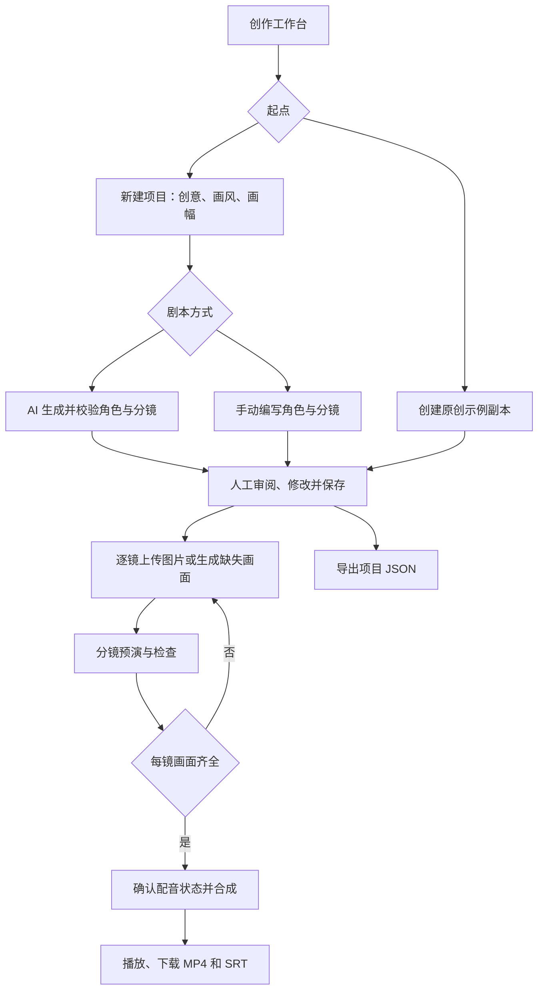
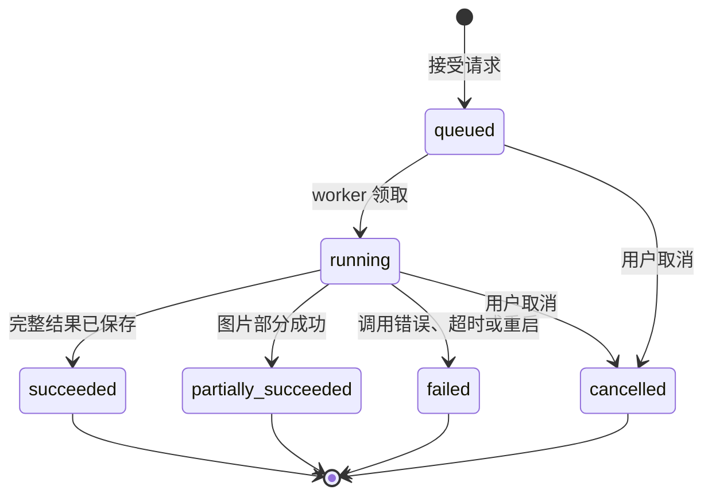
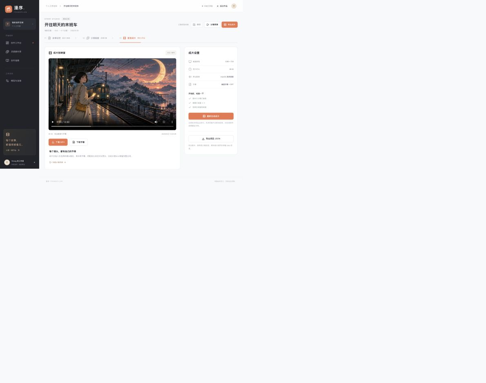

# 漫序 · FrameFlow 产品需求文档（PRD）

> 从一个故事创意，到一部可编辑、可播放、可导出的动态漫剧。

| 文档属性 | 内容 |
|---|---|
| 文档版本 | v1.1 完整版 |
| 对应产品 | 漫序 · FrameFlow，课程 MVP v1.0.0 |
| 编写日期 | 2026-09-22 |
| 文档状态 | 供课程提交、产品评审与后续开发使用；尚未获得教师评审 |
| 产品负责人 | 项目作者 Yiheng-guo；文档由 AI 辅助整理 |
| 目标用户 | 需要制作短篇动态漫画的学生与个人创作者 |
| 运行形态 | 本地单用户 Web 工作台，优先桌面浏览器，兼顾窄屏 |
| 依据 | 用户已确认的课程方向、当前代码、已有实测记录；没有外部用户访谈或商业数据 |

**阅读约定：**“已实现”表示当前代码具备能力；“已实测”表示已有对应运行证据；“待联调”表示接口已实现但没有完成真实供应商调用；“拟议”表示后续需求，不属于本次已交付功能。本文中的验收标准是检查要求，不等同于全部测试已经执行。

## 目录

1. [背景与问题](#1-背景与问题)
2. [用户与使用场景](#2-用户与使用场景)
3. [产品目标与衡量方式](#3-产品目标与衡量方式)
4. [范围、优先级与交付状态](#4-范围优先级与交付状态)
5. [核心流程与信息架构](#5-核心流程与信息架构)
6. [详细功能需求](#6-详细功能需求)
7. [数据与内容规则](#7-数据与内容规则)
8. [任务状态与异常处理](#8-任务状态与异常处理)
9. [页面与交互要求](#9-页面与交互要求)
10. [AI 能力与内容质量](#10-ai-能力与内容质量)
11. [非功能需求](#11-非功能需求)
12. [技术约束与接口边界](#12-技术约束与接口边界)
13. [验收用例与发布标准](#13-验收用例与发布标准)
14. [评估与反馈方案](#14-评估与反馈方案)
15. [版本计划与依赖](#15-版本计划与依赖)
16. [风险与待决事项](#16-风险与待决事项)
17. [交付物与来源说明](#17-交付物与来源说明)
18. [术语与变更记录](#18-术语与变更记录)

## 1. 背景与问题

### 1.1 项目背景

本项目来自 AI 漫剧相关课程作业。用户已确认采用“故事输入 → AI 剧本与分镜 → 漫画画面 → 配音字幕 → 视频导出”的创作工作台方向；教师暂未指定技术框架、必选功能、报告模板或明确截止日期，优先交付可运行、可解释、可展示的完整流程。

参考材料为用户提供的 MoneyPrinterTurbo 源码压缩包。参考其脚本、素材、配音、字幕、视频分阶段处理的思路，独立设计面向漫剧的角色设定、分镜编辑、人工审阅与作品管理。

### 1.2 要解决的问题

以下是基于制作流程提出的产品假设，尚未通过外部用户研究验证：

| 制作环节 | 可能的困难 | 本项目的解决方式 |
|---|---|---|
| 从创意到故事 | 有一句灵感，但不知道如何拆成镜头 | AI 返回可编辑的角色和结构化分镜 |
| 从故事到画面 | 剧本、图片与旁白分散，难以对应 | 每镜集中呈现画面描述、图片提示词、旁白与时长 |
| 修改与审阅 | 全自动结果难以局部调整 | 用户逐镜修改、排序、上传图片后再合成 |
| 合成成片 | 不熟悉配音、字幕和编码操作 | 后台统一完成旁白、字幕、镜头推拉及 MP4 输出 |
| 等待与失败 | 刷新丢进度，重试可能重复调用 | 持久化任务、明确状态、幂等提交和保留中间素材 |
| 课程展示 | 页面能看，但无法证明流程真实可用 | 提供真实调用样例、成片、测试记录与来源说明 |

### 1.3 产品定位

漫序是一个 AI 辅助的短篇动态漫画制作工具。用户负责创意、审阅和最终内容选择，AI 辅助编剧及可选画面生成，程序负责素材组织和媒体合成。

本版“漫剧”指漫画静帧配合镜头推拉、旁白和字幕形成的视频。没有连续人物动作、口型同步或图生视频；不把这些能力作为当前卖点。

## 2. 用户与使用场景

### 2.1 用户划分

| 用户 | 核心任务 | 成功结果 | 设计重点 |
|---|---|---|---|
| 课程学生（主要） | 制作并解释一部 AI 漫剧作品 | 可运行项目、可播放成片、可说明的实现过程 | 示例可上手、流程完整、文档可复现 |
| 个人故事创作者（次要） | 将短篇故事快速可视化 | 分镜可修改，素材可替换，成片可下载 | 内容控制、低配置试用、局部编辑 |
| 教师或评审（查看者） | 判断功能真实性与工程质量 | 能复现演示，理解参考范围与限制 | 明确来源、实测证据、合理能力边界 |

本版不存在不同登录角色或权限；上表描述使用目的，不表示已实现角色管理。工作区名称也不代表已接入账号系统。

### 2.2 关键用户故事

- **US-01 首次体验：**作为学生，我希望不配置模型就能打开示例并合成一次，理解产品怎么用。
- **US-02 创意展开：**作为创作者，我希望输入人物、冲突和结局，让 AI 给出可检查的分镜初稿。
- **US-03 人工修订：**作为创作者，我希望替换某一镜的图片、旁白和时长，不必重做整个故事。
- **US-04 成片输出：**作为学生，我希望下载通用视频和字幕文件，在课堂直接播放。
- **US-05 中断恢复：**作为用户，我希望刷新页面后看到原任务状态，避免再次点击导致重复执行。
- **US-06 透明展示：**作为评审，我希望能区分预制素材、上传内容和真实 AI 输出，判断哪些能力已验证。

### 2.3 典型场景

**场景 A：五分钟课堂演示。**打开《开往明天的末班车》示例，修改一处旁白并保存，展示分镜预演，合成并下载成片，说明参考来源与实现边界。

**场景 B：从零创作。**输入“一个女孩在末班列车遇见十年后的自己”，选择画风和画幅，生成剧本，审阅角色及镜头，上传原创画面或调用已配置的图片服务，最后合成。

**场景 C：缺少 AI 凭证。**用户仍可创建项目、手动添加角色和分镜、上传图片、预演和导出。macOS 可使用本机语音；没有可用语音服务时明确输出无配音视频。

**场景 D：生成中断。**任务运行时刷新页面，继续查看同一任务；若 worker 重启导致任务失败，保留已有素材，由用户决定是否重新发起。

## 3. 产品目标与衡量方式

### 3.1 本版目标

1. 将故事、角色、分镜、图片、配音和字幕组织为一个可操作的制作流程。
2. 支持人工控制内容，避免生成后无法修改或未经确认直接进入下一阶段。
3. 产出真实可播放的 MP4，并保留可编辑项目及字幕。
4. 在本地设备上复现关键功能，并能解释运行条件与失败原因。
5. 为课程提交提供源代码、需求、设计、验收和展示材料。

### 3.2 指标定义

| 指标 | 定义与目标 | 证据及当前状态 |
|---|---|---|
| 核心流程完成 | 从创建或打开示例到保存、合成、播放、下载全部可执行 | 已有本机验收；见[验证记录](验证记录.md) |
| 真实编剧调用 | 至少一份经结构校验并保存的真实模型结果 | 已有《把星星寄回家》4 镜样例 |
| 真实媒体产物 | 至少一部含中文配音和字幕、可解码的视频 | 已有约 30 秒横屏示例 |
| 持久化正确性 | 已保存修改刷新后不丢失；刷新不创建任务 | 已有浏览器测试 |
| 异常可解释性 | 核心失败场景给出原因与下一步，不能伪报成功 | 部分已有测试，完整矩阵见第 13 节 |
| 新用户易用性 | 拟邀请至少 3 位未接触项目的同学独立完成示例流程，记录困难 | 尚未开展，不宣称满意度或转化率 |

不设无依据的“提效百分比”“生成成功率”或成本承诺。约 23 秒生成剧本是一次样例记录，不是性能 SLA；没有自动采集用户行为或成本统计。

## 4. 范围、优先级与交付状态

P0：缺少则无法完成基本制作；P1：改善可控性或扩展 AI 能力；P2：后续方向。优先级与实现状态分别记录。

| 编号 | 能力 | 优先级 | 当前状态 |
|---|---|---|---|
| FR-01 | 作品创建、列表、搜索、筛选、删除 | P0 | 已实现，主要流程已实测 |
| FR-02 | 原创示例入口 | P0 | 已实现、已实测 |
| FR-03 | 故事设定与 AI 剧本 | P0 | 已实现，Pi 路径已实测，其他兼容服务未逐一实测 |
| FR-04 | 角色档案维护 | P0 | 已实现，待补逐字段边界验收 |
| FR-05 | 分镜编辑、排序和保存 | P0 | 已实现，编辑保存已实测 |
| FR-06 | 图片上传与来源标识 | P0 | 已实现，真假图片校验已实测 |
| FR-07 | AI 生成缺失画面 | P1 | 已实现适配器，真实图片供应商待联调 |
| FR-08 | 分镜预演 | P0 | 已实现、已实测 |
| FR-09 | 配音、字幕、视频合成 | P0 | 本机中文配音和横屏视频已实测；外部 TTS 待联调 |
| FR-10 | MP4、SRT、项目 JSON 导出 | P0 | 已实现，成片与 JSON 导出已有验证 |
| FR-11 | 持久化任务、取消、恢复 | P0 | 已实现，核心规则与部分浏览器场景已测 |
| FR-12 | 能力状态与配置说明 | P0 | 已实现；配置就绪不等于远端连通性实测 |
| FR-13 | 素材示例与创作指南 | P1 | 已实现；不是通用素材资产管理系统 |

### 4.1 明确不在本版范围

- 多用户登录、团队权限、云端协作和在线分享作品。
- 公网托管、订阅付费、额度管理和自动社交平台发布。
- 长篇分集管理、专业时间轴剪辑、转场库、BGM 混音。
- 多角色独立音色、配音试听编辑、录音上传、逐句字幕校时。
- 图生视频、口型同步、LoRA 训练、角色参考图锁定。
- 自动保存、撤销历史、项目 JSON 导入、一键整包备份恢复。
- 自动审核系统、模型质量保证或素材商业使用权担保。

## 5. 核心流程与信息架构

### 5.1 主流程

用户可以返回前面步骤修改，任何修改不自动触发付费生成。图中箭头表示用户流程，不代表系统自动串行调用全部模型。

### 5.2 信息架构

| 页面 | 入口 | 核心内容 |
|---|---|---|
| 创作工作台 `/` | 默认首页 | 作品列表、示例、新建、搜索筛选 |
| 灵感素材库 `/?view=assets` | 侧栏 | 原创示例素材及说明 |
| 创作指南 `/?view=guide` | 侧栏 | 制作步骤与使用提醒 |
| 模型与连接 `/?view=settings` | 侧栏 | 剧本、图片、语音、FFmpeg、worker 的配置或运行状态 |
| 作品编辑器 `/project/:id` | 创建成功或作品卡片 | 故事与角色、分镜编辑、配音成片三个区域 |
| 分镜预演弹窗 | 编辑器 | 按镜头顺序播放静帧和文本预演 |

### 5.3 状态归属

- URL 保存项目定位与页面入口，不保存全部编辑数据。
- 后端保存项目、版本、任务和成片记录，是结果的事实来源。
- 当前选中镜头、弹窗、未保存输入、搜索筛选属于页面临时状态。
- 本版不承诺跨设备偏好同步，也不把刷新恢复理解为恢复所有未保存输入。

## 6. 详细功能需求

### FR-01 作品管理

**目的：**用户能找到并持续编辑自己的作品。

**规则：**新建时输入标题、故事创意、画风和画幅；标题必填，创意允许暂空以便先手动创作。创建成功后进入编辑器。工作台按创建顺序倒序列出作品；搜索匹配标题或创意，筛选为全部、创作中、已成片。当前“已成片”表示存在历史成片，不保证该成片对应最新编辑。

删除需要展示确认；有排队或运行任务时拒绝删除，提示先取消。删除数据库中的项目和任务记录，磁盘媒体暂留，不提供回收站或界面恢复功能。确认文案不能暗示可一键撤销。

**验收：**合法项目创建成功并可再次打开；空标题被拒绝；无作品、搜索无结果、加载失败分别显示；取消删除不改变数据；活动任务下删除被拒绝。

### FR-02 原创示例

**目的：**没有模型 Key 也能理解并体验流程。

**规则：**点击示例入口创建独立项目副本，包含四镜、角色、旁白和预制画面；修改副本不改写公共示例素材。标识脚本和图片的示例来源。仓库已有成片用于展示，新建示例副本仍需自行合成才能产生该项目的成片记录。

**验收：**关闭 AI 配置后仍可打开、编辑、保存和合成示例；页面不能把预制图片称为本次实时生成。

### FR-03 故事设定与 AI 编剧

**输入：**标题、故事创意、画风、画幅及已有角色描述。故事建议包含主角、目标、阻碍和结局，系统不强制用户填写结构化剧作表。

**前置条件：**故事创意非空，模型配置就绪，worker 在线，当前项目没有活动任务。提交前先保存修改，保存失败则不发起任务。

**规则：**支持兼容 Chat Completions 服务或已登录的本机 Pi。输出为标题、角色和镜头数组，经运行时校验后入库。生成提示建议 3–6 镜，结构校验接受 3–8 镜、1–4 个角色；与手动编辑最大容量区分。成功后用户审阅，不自动生图或合成。

重新生成前提示会替换当前角色和分镜，包括原图片关联，建议先导出 JSON；成功后才替换。失败保持原内容，不把不完整 JSON 写入项目。没有逐 token 流式剧本，本版展示任务阶段，最终一次提交结构化结果。

**验收：**合法输入生成可编辑分镜；未配置或空创意被阻止；非法模型结果显示失败且保留原内容；取消后迟到结果不能覆盖用户新编辑。

### FR-04 角色档案

**输入：**角色名称、描述与色标。描述建议包含发型、服装、年龄感、标志物与性格；这些不是分别存储的独立字段。

**规则：**支持维护至多 8 个角色；角色描述在画面生成时作为一致性约束。色标用于识别角色，不代表音色或独立画面风格。修改档案不会自动重生已有图片。

**验收：**合法角色可保存并刷新恢复；超出字段限制由服务端拒绝；描述能进入图片请求；不承诺跨镜头完全一致。

### FR-05 分镜编辑与保存

**输入：**镜头标题、画面描述、旁白、图片提示词、计划时长、镜头运动及图片。

**规则：**手动最多 12 镜，支持添加、删除和顺序调整。镜头运动为缓慢推进、缓慢拉远、固定镜头；计划时长为 2–30 秒。空旁白可用于无台词镜头。

编辑采用显式保存，提示未保存、保存中、已保存或失败。上传和启动任务前先保存。离开页面的未保存提醒依赖浏览器，不能据此承诺所有站内跳转均有可靠拦截。没有自动草稿恢复或多人合并；过期 revision 返回冲突，用户重新加载前应自行保留未保存内容。

**验收：**修改、保存、刷新后内容一致；顺序改变反映在预演和新成片中；保存失败不清除未保存标记；任务运行时禁止并发编辑。

### FR-06 逐镜图片上传

**规则：**支持 PNG、JPG、WebP，单文件最大 10 MB。服务端实际解码图片并重编码保存，不只检查扩展名。上传绑定指定镜头与项目 revision，覆盖该镜头的图片关联，来源标为 upload。文件在本机管理，不接受任意外部地址作为项目图片字段。

目标画幅合成采用居中裁切，横图用于竖屏时可能丢失边缘内容；本版没有手动裁切框或焦点选择。

**验收：**合法图可预览、保存和合成；伪装成图片的文本被拒绝；超限或解码失败不替换已有图片；冲突版本不能写入。

### FR-07 AI 生成缺失画面

**前置条件：**图片服务配置就绪、已有分镜且存在无图镜头。

**规则：**确认后按镜头顺序调用，只处理没有图片的镜头，已有图片保持。请求使用画风、角色描述及镜头提示词；成功的图片逐镜保存并标为 ai。部分失败时保留成功结果，再次发起只处理仍缺失的画面。本版没有针对已有图片的一键重绘与候选版本管理，用户可上传替换。

**供应商契约：**同步 `POST /images/generations`，返回 `data[0].b64_json` 或可下载的 HTTPS URL。异步供应商不在当前适配范围。使用对应账号额度，未实现费用估算或扣费核对。

**验收：**真实供应商完成至少一次生成、一次失败及部分成功保留场景后，才可标为联调通过。当前没有该类凭证，功能状态为待联调。

### FR-08 分镜预演

**规则：**按当前镜头顺序和计划时长展示静帧、标题与旁白文本，支持播放、暂停和关闭。它用于审阅画面顺序和叙事，不是最终视频播放器；不保证与配音延长后的成片时长一致。

**验收：**播放与暂停状态可辨认；镜头按顺序切换；Esc 可关闭弹窗；缺图时显示占位而非假图片。

### FR-09 配音、字幕与合成

**前置条件：**至少一镜，每镜有图片，FFmpeg 可用，worker 在线。

**配音规则：**macOS 默认系统中文语音；可选兼容 Speech 接口。未配置语音时确认框说明输出无配音成片；已经选择语音服务但调用失败时报告失败，不静默冒充配音成功。空旁白不生成语音。当前统一音色，没有按角色分配声音。

**时长规则：**每镜实际时长取计划时长与配音时长加约 0.4 秒缓冲的较大值。2–30 秒是输入限制，不是实际成片镜头的硬上限。

**字幕规则：**旁白同时用于画面字幕与独立 SRT；按镜头时间段显示，不做语音识别和逐词对齐。字符转义后渲染；本版固定字体布局，无字幕样式编辑器。

**视频规则：**16:9 输出 1280×720，9:16 输出 720×1280，24fps，H.264 视频与 AAC 音轨、MP4 容器。无配音镜头可带静音音轨，“存在音轨”不能用作已配音证据。支持镜头推拉及固定画面，不包含人物动作生成。

**验收：**全片可解码、可播放、无缺图黑屏；有旁白时可听且不截断；中文不缺字；字幕顺序与镜头一致；失败不能产生成功记录。横屏已有样例，竖屏完整视听验收仍需补测。

### FR-10 产物查看与导出

**规则：**合成成功后提供播放器、MP4 和 SRT 下载；媒体接口支持 Range 请求以便拖动播放。项目 JSON 导出用于保留脚本和媒体引用，不包含图片或视频二进制，也没有对应导入界面。

修改项目不自动重新合成；旧成片仍可查看，但提示是上一次结果，用户需主动重新合成以应用修改。重新合成成功后界面指向新结果，当前没有完整成片版本管理界面。

**验收：**下载文件类型正确且可打开；JSON 可解析；修改后的旧成片被明确标识；错误 Range 返回 416，合法分段返回 206。

### FR-11 任务管理与恢复

**规则：**任务类别为 script、images、render。单项目最多一个 queued/running 任务，当前 worker 全局串行消费，其他作品任务可以排队。界面展示任务阶段、进度和信息，百分比为阶段进度，不是供应商精确进度或剩余秒数。

提交携带幂等键；同项目同类型同键返回原任务，键跨项目或类型复用拒绝。提交异常后先查询项目现有任务，避免立即创建新的任务。取消由服务端更新状态并中止本地处理；已经完成的素材保留，不承诺远端请求停止计费。

刷新恢复已保存项目及最新任务。worker 重启时 running 标记失败，queued 继续处理；失败任务由用户主动重新提交，不自动重复调用模型。没有断点续编视频，重新合成重新执行媒体流程。

**验收：**重复请求只对应一个任务；取消后仍保持 cancelled，迟到结果不能覆盖；浏览器关闭不等同于取消；worker 重启不把中断任务标成成功。

### FR-12 模型与连接

**规则：**显示剧本提供方、图片配置、语音方式、FFmpeg 与 worker 状态，附服务端配置指引。密钥留在 `.env.local`，界面和状态 API 不返回密钥。修改配置需重启服务。

“重新检查连接”当前重新读取配置与本地健康状态，不执行所有供应商的探测请求。配置就绪不证明账号权限、余额或远端模型可调用；真实任务结果才作为调用证据。

**验收：**缺配置时给出对应操作说明；没有能力时允许手动流程；状态响应不含凭证；前端不把配置检查当成联调通过。

### FR-13 创作指南与示例素材

**规则：**解释制作顺序、画幅、素材准备、配置及产品边界。素材库展示现有原创示例，不宣称支持用户通用素材上传管理、标签或检索。

**验收：**入口可达，示例来源清楚，指南与实际按钮和流程一致；课堂演示有可用的预先合成视频作备用，并标明预制身份。

## 7. 数据与内容规则

### 7.1 核心对象

| 对象 | 关键字段 | 业务含义 |
|---|---|---|
| Project | id、title、idea、style、ratio、revision、createdAt、updatedAt | 一个独立作品及其当前版本 |
| Character | id、name、description、color | 角色描述与显示标识 |
| Shot | id、title、description、narration、imagePrompt、duration、camera、imageUrl、imageSource | 一段按顺序排列的镜头 |
| Job | id、projectId、kind、status、progress、message、error、时间 | 一次可追踪的后台执行 |
| Render | videoUrl、srtUrl、duration、hasAudio、revision、createdAt | 一次已完成的媒体产物引用 |

角色与镜头保存在项目内容中；本版没有独立的“镜头角色 ID 列表”。角色描述作为整体提示上下文，不能把它理解成精确的出场角色关联数据库。

### 7.2 字段约束

| 字段 | 规则 |
|---|---|
| 项目标题 | 去除首尾空白后 1–60 字符 |
| 故事创意 | 最多 6000 字符；发起 AI 编剧时不得为空 |
| 画风 | 电影日漫、清新水彩、国风水墨、赛博都市 |
| 画幅 | 16:9 或 9:16 |
| 角色 | 手动最多 8 个；名称 1–40 字符，描述最多 600 字符，色标为十六进制颜色 |
| 分镜 | 手动最多 12 镜；标题 1–80 字符 |
| 画面描述 | 最多 1400 字符 |
| 旁白 | 最多 160 字符；允许为空 |
| 图片提示词 | 最多 2000 字符 |
| 计划时长 | 2–30 秒 |
| 图片来源 | none、demo、upload、ai |
| 剧本来源 | manual、demo、ai；手动修改 AI 稿件不等于保存逐句来源历史 |

字符串上限按当前校验器计算，不保证复杂 Unicode 字符与肉眼字数完全一致。输入限制用于控制本地制作规模，不是长篇内容拆集能力。

### 7.3 保存、备份与删除

数据库与素材分别位于 `data/studio.sqlite`、`data/assets/`，均不提交 GitHub。关闭服务后复制完整 `data` 目录是当前完整备份方式，单独 JSON 不等于可恢复整部作品。项目删除不自动清理所有磁盘媒体，长期使用需人工管理空间。不存在云同步或跨设备自动恢复承诺。

## 8. 任务状态与异常处理

### 8.1 状态机

重试创建新任务，不修改旧终态。等待确认是提交前的界面状态，不是已入库任务状态；connected/disconnected 是浏览器连接状态，与任务执行状态独立。

### 8.2 异常矩阵

| 情况 | 用户看到什么 | 恢复方式 / 数据处理 |
|---|---|---|
| 首次加载中 | 加载提示 | 不显示为“没有作品” |
| 无作品 / 搜索无结果 | 不同的空态说明 | 创建或调整筛选 |
| 未配置模型 | 配置提示，AI 操作不可用 | 配置后重启，或手动创作 |
| worker 不在线 | 后台未启动提示 | 使用完整启动命令，已有项目保留 |
| 排队或运行 | 阶段、进度、取消入口 | 禁止同项目重叠修改 |
| 提交响应丢失 | 错误或连接提示 | 先查询任务，当前页面可复用请求键 |
| 轮询断线 | 连接异常提示 | 保持后端任务；恢复后重新读取状态 |
| 模型失败 / 非法 JSON | 失败原因与检查建议 | 保留之前的角色分镜，不自动付费重试 |
| 生图部分失败 | 完成数与失败数 | 保留已有图片，重试缺失项 |
| 图片不合法 / 过大 | 上传错误 | 原图片关联不改变 |
| 图片缺失 | 不允许合成 | 补齐每镜图片 |
| revision 冲突 | 提示其他页面已更新 | 保留或复制当前输入后再加载，不静默覆盖 |
| 无语音配置 | 合成前告知无配音 | 用户可继续或先配置 |
| 语音 / FFmpeg 失败 | 合成失败 | 原项目保留，修复环境后重试 |
| 取消 | 已取消、已有素材保留 | 允许继续编辑或发起新任务 |
| worker 重启 | 原运行任务显示中断失败 | 保留素材，用户决定重试 |
| 成片过期 | 上一次成片提示 | 重新合成，不能冒充最新稿件 |
| 项目不存在 | 明确不存在或已删除 | 返回工作台 |
| 磁盘满 / 文件损坏 | 应报告失败而非成功 | 人工释放空间或恢复备份；专项验收待补 |

当前任务总时限为 15 分钟，部分子进程有更短时限。达到时限表示本次失败，不证明所有外部服务已终止。跨刷新保留全部幂等上下文、失败后的自动对账和复杂网络故障压力测试尚待完善。

## 9. 页面与交互要求

### 9.1 工作台

先解释用户能完成什么，再提供“新建漫剧”和“打开示例”入口。作品卡片展示标题、封面、镜头数量、画风、画幅、更新时间和成片状态；搜索与筛选不触发后端生成。素材卡片与任务状态不能使用虚假实时进度装饰。

### 9.2 编辑器

故事与角色用于设定，分镜页用于逐镜修改，配音成片页用于最终检查与导出。分镜列表和当前选中镜头保持一致；重排后保持可理解的选择状态。运行中明确锁定编辑，避免用户以为修改已经进入正在执行的快照。

### 9.3 成片页

展示计划时长与真实成片信息时区分含义；合成确认框说明镜头数量和配音能力。最终播放器与分镜预演分开命名。旧结果可访问，但修改后应提示需重新合成。

### 9.4 通用交互

- 延续暖白工作区、深色侧栏和橙色重点，统一成功、失败、警告与禁用态。
- 主要按钮使用动作名称，如保存、生成缺失画面、开始合成；避免只有图标没有可访问名称。
- 覆盖 390、768、1280、1440px，窄屏重排侧栏、镜头列表和编辑区域；无横向溢出不等于所有交互均已真机验收。
- 键盘可到达主要按钮和表单，焦点可见；弹窗支持关闭和 Esc，不让隐藏侧栏截获焦点。
- 删除、重新生成、外部生成调用前说明影响；不能把前端禁用作为唯一并发或安全保护。
- 当前没有全量无障碍审计、屏幕阅读器认证或移动设备实测结论。

## 10. AI 能力与内容质量

### 10.1 输入输出边界

AI 负责提出剧本初稿和可选图片；用户负责审阅角色设定、叙事连贯性和素材适用性。提示词明确用户创意是素材，返回内容按结构校验，不能执行模型返回的命令。Pi 在本项目中用于无工具文本生成，不读取项目上下文或开放 shell 工具给这次剧本任务。

### 10.2 剧本审阅标准

每份输出应具备可辨认的主角、目标或冲突、情节变化与结尾；每镜应描述可画出的具体场景和动作，旁白提供有效叙事信息。避免所有镜头重复同一句主题，避免角色特征无故变化，避免明显超出短片容量的情节。

结构合法仅证明数据可被程序处理，不能证明故事质量。当前由用户人工审阅；没有独立模型评审、多轮自动修稿或内容审核后台。

### 10.3 画面与配音质量

角色档案只是提示约束，画风选项也不保证不同供应商输出完全一致。生成结果须检查人物、服装、主体裁切和错误文字，必要时人工上传替换。配音检查语句是否完整、专名发音和可听性；当前没有自动修正读音与音量标准化编辑界面。

### 10.4 内容、隐私与调用

故事、角色描述或旁白在用户触发对应任务时会传给配置的服务；本地保存不等于内容始终不出设备。使用本机语音或手动素材时，相关处理可以留在本机。素材来源需标记，公开展示前由创作者确认其适用范围；项目不声称自动取得上传素材的使用权。

## 11. 非功能需求

| 编号 | 要求 | 当前边界与验收方式 |
|---|---|---|
| NFR-01 持久化 | 保存和任务状态以服务端数据库为准 | 重启、刷新、冲突检查；不承诺恢复未保存文本 |
| NFR-02 一致性 | 不允许活动任务与手动修改互相覆盖 | 事务、revision、活动任务唯一约束及取消结果保护 |
| NFR-03 可用性 | 没有 AI 服务仍可体验示例和手动流程 | 空配置验收；没有语音时明确无配音 |
| NFR-04 安全 | 密钥不进前端和仓库，写接口校验来源，上传实际解码 | 检查响应、构建产物和 Git 文件；本地边界不是公网鉴权 |
| NFR-05 性能 | 界面不因长任务同步阻塞；显示阶段而非长时间无反馈 | 异步任务与轮询；没有正式基准，不承诺固定生成秒数 |
| NFR-06 资源 | 单 worker 串行，避免个人设备多路编码争抢 | 队列与任务上限；没有磁盘配额、成本预算系统 |
| NFR-07 兼容性 | Node.js 24+，现代桌面浏览器，横竖画幅 | macOS 已实测；Windows/Linux、竖屏与移动真机需补专项验收 |
| NFR-08 可维护性 | 共享数据契约、集中接口适配、文档可追踪 | lint、类型检查、核心测试、构建和变更记录 |
| NFR-09 可观察性 | 用户可知任务类别、阶段、错误和结果 | 任务持久化；暂无独立运维监控或调用成本看板 |
| NFR-10 可解释性 | 明确示例、人工与 AI 来源及功能限制 | 检查页面文案、README 与验收记录一致 |

## 12. 技术约束与接口边界

采用 Next.js、React、TypeScript、Tailwind、SQLite、独立 Node worker、Sharp 与 FFmpeg，减少课程项目多服务部署负担。技术适配见[技术适配声明](技术适配声明.md)，详细契约见[架构与接口](架构与接口.md)，不在 PRD 内复制所有实现细节。

| 产品行为 | 对应接口 |
|---|---|
| 作品列表与创建 | GET / POST `/api/projects` |
| 读取、修改、删除作品 | GET / PATCH / DELETE `/api/projects/:id` |
| 发起剧本、生图或合成 | POST `/api/projects/:id/jobs` |
| 上传镜头图片 | POST `/api/projects/:id/images` |
| 查询与取消任务 | GET `/api/jobs/:id`，POST `/api/jobs/:id/cancel` |
| 查看能力状态 | GET `/api/settings` |
| 播放及下载媒体 | GET `/api/assets/:project/:file` |

服务默认绑定 `127.0.0.1:3210`。上传 GitHub 仅发布代码与公开示例，不表示作品网站已部署。公网部署需另立范围，补齐账户、访问控制、资源隔离、私有存储、配额和运维方案。

## 13. 验收用例与发布标准

### 13.1 用例矩阵

“已有证据”引用之前的测试和样例，不表示本次文档更新重新执行了真实供应商调用。

| 用例 | 关联需求 | 操作 / 条件 | 预期结果 | 当前证据 |
|---|---|---|---|---|
| AC-01 | FR-01/02 | 创建示例并打开 | 独立作品、来源明确、可编辑 | 浏览器测试 |
| AC-02 | FR-05 | 修改镜头保存再刷新 | 修改仍在，保存状态正确 | 浏览器测试 |
| AC-03 | FR-03 | 输入新创意调用 Pi | 角色和分镜通过校验并入库 | 真实 AI 样例 |
| AC-04 | FR-03 | 模型输出非法结构 | 失败，不替换原稿 | 解析规则测试；供应商端到端故障待补 |
| AC-05 | FR-04/05 | 字段边界、增删与重排 | 校验有效，顺序一致 | 部分核心规则测试；完整矩阵待补 |
| AC-06 | FR-06 | 上传有效图和伪 PNG | 有效图保存，伪图拒绝 | 浏览器测试 |
| AC-07 | FR-06 | 上传超过 10 MB 图片 | 拒绝且原图保留 | 代码已有，专项用例待补 |
| AC-08 | FR-07 | 生图成功及部分失败 | 成功项保留，只重试缺失项 | 待真实图片联调 |
| AC-09 | FR-08 | 预演、播放、暂停、Esc | 交互正确，无残留弹窗 | 浏览器测试 |
| AC-10 | FR-09 | 缺一镜图片时合成 | 返回缺图错误，不启动合成 | 浏览器测试 |
| AC-11 | FR-09/10 | 四镜中文旁白横屏合成 | 可听、字幕可读、全片可播放 | 30 秒样例与媒体检查 |
| AC-12 | FR-09 | 无旁白合成 | 明确无配音，视频可播放 | 浏览器真实渲染测试 |
| AC-13 | FR-09 | 9:16 与长旁白合成 | 竖屏字幕不越界、台词不截断 | 待专项视听验收 |
| AC-14 | FR-10 | JSON、MP4、SRT 下载 | 文件可用，JSON 不冒充完整备份 | JSON 与成片已有验证；SRT 专项检查待补 |
| AC-15 | FR-10 | Range 请求 | 合法 206，越界 416 | 浏览器测试 |
| AC-16 | FR-11 | 同键重复提交 | 返回同一任务，无重复执行 | 核心与浏览器测试 |
| AC-17 | FR-11 | 提交后取消并编辑 | cancelled 保持，编辑成功 | 浏览器测试；运行中多阶段取消待补 |
| AC-18 | FR-05/11 | 过期版本修改 / 跨源写入 | 409 / 403，数据不变 | 浏览器测试 |
| AC-19 | FR-11 | 断线恢复与 worker 重启 | 不重复创建任务；中断有说明 | 代码及部分规则覆盖，完整故障演练待补 |
| AC-20 | FR-10 | 修改已有成片项目 | 显示旧成片提醒 | 已实现，专项自动验收待补 |
| AC-21 | NFR-07 | 四种宽度打开主要页面 | 无横向溢出，关键入口可用 | 自动布局检查及人工视觉检查 |
| AC-22 | FR-12 | 缺凭证检查状态接口 | 无密钥返回，不假报模型连通 | 已实现，真实模型另有调用证据 |
| AC-23 | FR-01 | 删除取消 / 活动任务删除 | 取消不删除，活动任务拒绝 | 代码已有，完整交互验收待补 |

### 13.2 交付门槛

课程 MVP 可交付条件：基本示例制作流程可运行，真实编剧与成片有证据，关键并发和上传校验通过，源码可启动，已知限制清楚，来源与配置说明齐全。当前交付以此为标准。

宣称“完整自动生图链路可用”前，必须补齐 AC-08 的真实服务联调；宣称“跨平台通用”前，必须在对应平台安装并完成核心流程；宣称“公网可用”前，必须完成新的部署与权限验收。

每次应用代码变更执行 lint、类型检查、有意义的测试与生产构建；交互或媒体流程变化时补真实浏览器及视听检查。详细执行记录放在[验证记录](验证记录.md)，不在本表伪造完成状态。

## 14. 评估与反馈方案

本版不加追踪 SDK。先用人工记录评估：邀请至少 3 位同学，在环境已启动的条件下独立完成示例编辑与成片；记录首次找到入口所需时间、阻塞步骤、成功与否、是否需要提示，以及“下一步是否清楚”的反馈。该方案尚未执行。

建议记录：项目匿名编号、任务类别、是否成功、耗时、错误类别、是否重试、人工帮助次数。不要默认记录故事全文、图片、密钥或账号信息。性能报告应注明设备、分镜数量、画幅、语音方式与供应商，不能把单次样例平均化。

内容质量可用五项各 1–5 分的拟议评分：叙事完整、镜头可画、角色连贯、旁白清晰、成片可读可听。评分由人工完成，先记录理由，再决定下一版优先改进项；不作为当前已测成绩。

## 15. 版本计划与依赖

| 阶段 | 交付重点 | 进入 / 退出条件 | 状态 |
|---|---|---|---|
| M0 范围确定 | 本地创作工作台、课程目标 | 用户认可核心方向 | 已完成 |
| M1 可编辑流程 | 项目、角色、分镜、上传、预演 | 可保存并刷新恢复 | 已实现，主要场景已验收 |
| M2 真实输出 | AI 剧本、本机语音、字幕、视频 | 一次真实模型调用与一部可播放成片 | 已完成基础验证 |
| M3 课程交付 | 公开源码、完整 PRD、来源与演示文档 | 文档和实际能力一致 | 本次补齐完整 PRD |
| M4 服务与边界补测 | 图片供应商、外部语音、竖屏、运行中取消等 | 获得具体服务配置和测试环境 | 待推进 |
| M5 体验迭代 | 草稿恢复、导入备份、角色参考图或多音色 | 根据同学试用结果定优先级 | 拟议，未排期 |
| M6 公网版本 | 账号、隔离、配额、存储及运维 | 用户明确部署需求与资源方案 | 不在当前范围 |

没有指定外部截止日期，因此采用验收门槛而非虚构日程。图片和语音服务的供应商、模型、额度与预算尚待确定；不会因为文档列入后续阶段而自动购买或开通服务。

## 16. 风险与待决事项

| 风险 / 未决项 | 影响 | 对策与决定时机 |
|---|---|---|
| 教师评分要求未知 | 可能还需报告格式、数据库图或特定语言 | 获得正式要求后调整交付，不虚构学校规范 |
| 图片 / 外部语音服务未联调 | 无法承诺一键全 AI 成片 | 当前提供上传和本机语音，选定服务后补联调 |
| 角色一致性不足 | 同一角色可能变脸或服装改变 | 统一描述、人工审阅；参考图方案后续评估 |
| 配置就绪但调用失败 | 用户误判账号或网络问题 | 区分配置状态与真实请求结果 |
| 长旁白与竖屏字幕 | 画面拥挤、时长超预期 | 限制输入、延长镜头，补极值视听验收 |
| 缺中文字体 | 字幕缺字 | 启动说明给出字体要求，实测抽帧检查 |
| 本地空间持续增长 | 合成失败或磁盘占满 | 手动备份清理，后续增加配额与清理工具 |
| 未保存编辑或站内离开 | 输入丢失 | 显式保存提示；可靠导航拦截与草稿恢复列为后续 |
| 网络异常与远端费用 | 重试可能再次消耗额度 | 不自动重试供应商调用，明确取消的费用边界 |
| 无多用户隔离 | 直接公网暴露不适用 | 保持本地绑定，部署另行设计 |

仍需用户或教师决定的事项：是否需要 Word/PDF 课程报告、正式答辩 PPT、特定课程模板；是否采购或使用已有图片服务；是否要求公网演示。本 PRD 不依赖这些决定才能用于当前本地项目。

## 17. 交付物与来源说明

| 材料 | 入口与用途 |
|---|---|
| 项目启动与使用 | [README](../README.md) |
| 产品需求 | 本文 |
| 技术选型 | [技术适配声明](技术适配声明.md) |
| 系统与接口 | [架构与接口](架构与接口.md) |
| 实施过程和进度 | [阶段开发文档](阶段开发文档.md)、[当前进度](当前进度.md) |
| 测试证据 | [验证记录](验证记录.md)、`tests/` |
| 课堂讲解 | [课堂演示](课堂演示.md) |
| AI 真实文本样例 | [ai-script-example.json](ai-script-example.json) |
| 已生成视频和字幕 | [film.mp4](../public/demo/film.mp4)、[subtitles.srt](../public/demo/subtitles.srt) |
| 素材与许可 | [素材来源](素材来源.md)、[第三方说明](../THIRD_PARTY_NOTICES.md) |

参考 MoneyPrinterTurbo 的分阶段视频流水线思路，不将其源码换名作为原创成果；当前项目独立实现。具体上游版本与 MIT 许可见第三方说明。示例漫画画面由 AI 在开发阶段生成，来源已记录。源代码和文档使用 AI 辅助开发与整理，课堂展示应说明这一过程；不声称训练了原创基础模型或完成未经执行的用户研究。

## 18. 术语与变更记录

| 术语 | 本文含义 |
|---|---|
| 动态漫画 | 静态漫画图片加镜头运动、旁白和字幕组成的视频 |
| 分镜 | 一段具有画面、旁白、时长和运动方式的制作单元 |
| 提示词 | 发送给模型的创作描述，不是需要执行的程序 |
| worker | 与网页分开的本地后台任务进程 |
| revision | 用于检测并发覆盖的项目版本号，不是可回滚历史版本 |
| 幂等键 | 识别同一次提交，重复请求返回原任务 |
| 部分成功 | 图片任务只有一部分镜头完成，成功素材已经保留 |
| MVP | 能完成核心任务且边界明确的第一版产品 |

| 文档版本 | 变更 |
|---|---|
| v1.0 | 简要定位、第一版范围、成功标准与边界 |
| v1.1 | 基于现有代码补齐用户场景、13 项功能、数据规则、状态异常、非功能需求、23 项验收用例、评估方案和版本计划；明确实测、待联调与拟议范围 |
